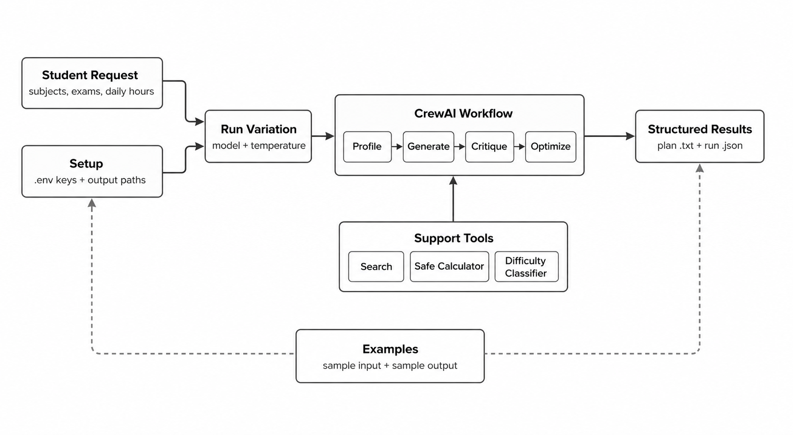

# AI Study Planner Agents

AI Study Planner Agents is a fully functional Python project for generating personalized study schedules from subjects, exam dates, and available daily study hours.

The project combines CrewAI agents, GPT-4o mini, sentence-transformer subject difficulty classification, tool-augmented planning, safe arithmetic helpers, and structured evaluation artifacts. The included notebook serves as an interactive interface over the `study_planner` package, allowing the core logic to be executed, tested, and extended natively.

## Tech Stack & Core Skills

This project demonstrates practical multi-agent AI workflows and tool integration:
- Designing a multi-agent AI architecture using CrewAI.
- Combining LLM planning with deterministic helper tools (e.g., safe calculators, external search).
- Using transformer embeddings (`all-MiniLM-L6-v2`) for semantic classification of subject difficulty.
- Evaluating LLM output quality across different model parameter settings.
- Turning a notebook prototype into a fully testable, production-ready Python package.

## Architecture Diagram



## Agent Architecture

The multi-agent workflow relies on specialized agents to process, critique, and refine the study plan:

| Agent | Responsibility |
| --- | --- |
| Student Profiler | Extracts subjects, exam dates, study capacity, and subject difficulty from the user's input. |
| Study Plan Generator | Builds an initial day-by-day plan using planning constraints and tool support. |
| Plan Critic | Reviews the generated plan for logical errors, constraint violations, overloaded days, and quality issues. |
| Plan Optimizer | Produces the corrected final schedule based strictly on the critique feedback. |

## System Workflow & Key Features

The pipeline processes user inputs through a coordinated sequence of steps to ensure a realistic and optimized schedule:

1. The student provides their subjects, exam dates, and daily available study hours.
2. The transformer embedding model classifies the difficulty of each subject (hard, medium, or easy) based on semantic similarity.
3. The Student Profiler converts the raw request into structured planning data.
4. The Study Plan Generator creates a day-by-day schedule.
5. The Plan Critic checks the schedule for overloaded days, missing buffer days, incorrect exam handling, and weak subject prioritization.
6. The Plan Optimizer revises the schedule using the critic feedback.
7. The evaluation logic parses the final plan, scores it, and saves structured JSON and text artifacts.

## Examples

To see the agent workflow in action, you can review the sample inputs and outputs:
- Input profile: [examples/sample_input.json](examples/sample_input.json)
- Example optimized schedule: [examples/sample_output.md](examples/sample_output.md)

## Repository Structure

The codebase is organized into a reusable package and supporting documentation:

```text
src/study_planner/             Reusable Python package
  agents.py                    CrewAI agent factories
  config.py                    Output path and environment loading helpers
  difficulty.py                Sentence-transformer difficulty classifier
  evaluation.py                Structured plan parsing and scoring
  runner.py                    High-level variation runner and artifact saving
  tasks.py                     CrewAI task definitions
  tools.py                     Safe calculator and CrewAI tool wrappers
notebooks/study_planner_demo.ipynb
examples/sample_input.json     Example student profile
examples/sample_output.md      Example optimized schedule
tests/                         Unit and layout tests
pyproject.toml                 Project metadata and dependencies
requirements.txt               Editable install entrypoint
.env.example                   Example environment variables
```

## Requirements

If you wish to run the demo notebook locally, the following setup is required:

- Python 3.10+
- OpenAI API key
- Serper API key
- Jupyter Notebook or Google Colab for the demo notebook

Install the project dependencies:

```bash
pip install -r requirements.txt
```
